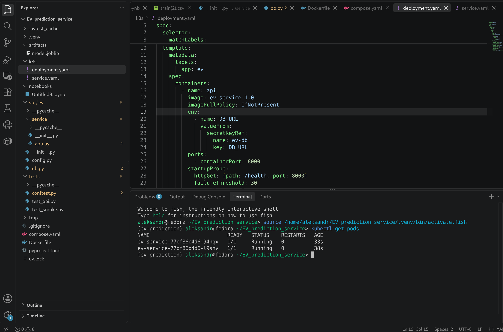
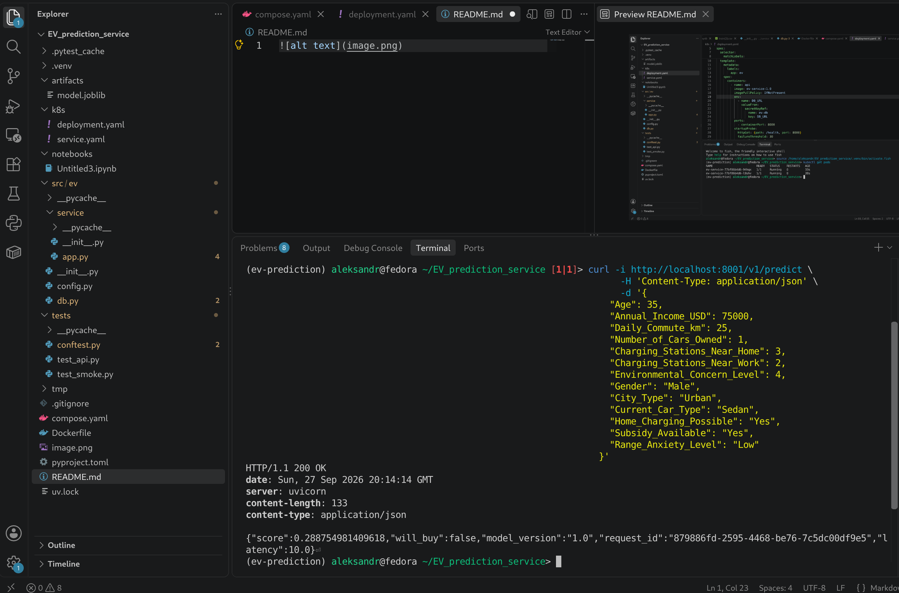
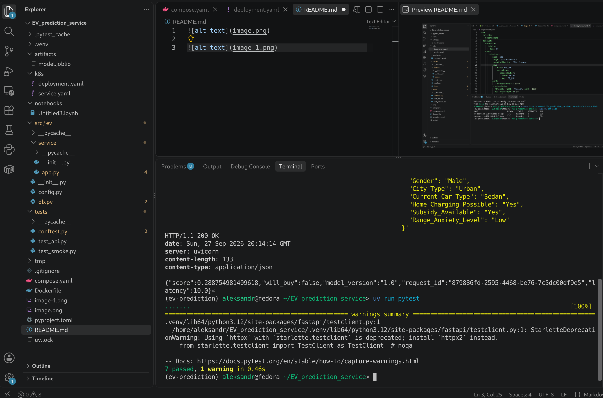
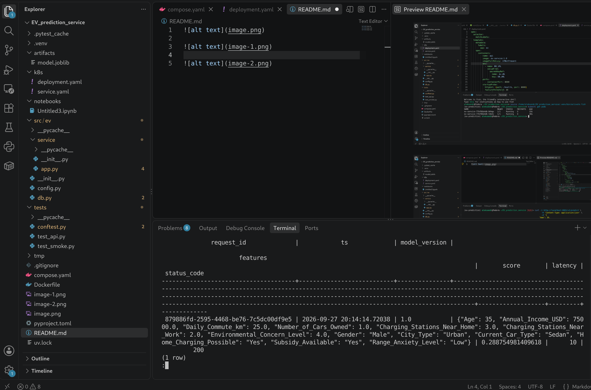
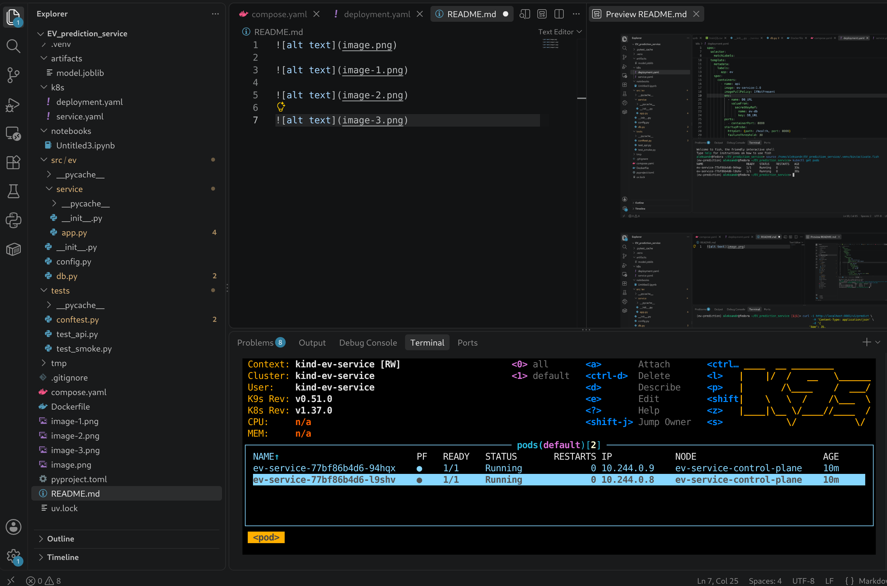

### 1. Тесты

```bash
uv run pytest
```

### 2. Docker Compose

```bash
docker compose up -d
```

### 3. kind

```bash
kind create cluster --name ev-service
kind load docker-image ev-service:1.0 --name ev-service
```

```bash
kubectl apply -f k8s/
kubectl rollout status deployment/ev-service
kubectl get pods
```

## Скриншоты

### Тесты



### Поды



### Ответ сервера на POST запрос, порт пробросил в другом терминале



### Вывод SELECT запроса 



### k9s




### Журнал ошибок

Серьезных проблем не возникло, но вылетала ошибка 
``` 
FAILED tests/test_api.py::test_bad_age_is_422 - TypeError: only 0-dimensional arrays can be converted to Python scalars
FAILED tests/test_smoke.py::test_predict_smoke - TypeError: only 0-dimensional arrays can be converted to Python scalars
ERROR tests/test_smoke.py::test_batch_and_single_agree 

    @app.post("/v1/predict", status_code=200)
    def predict(x: Features, bg: BackgroundTasks):
        t0 = time.perf_counter()
        request_id = str(uuid.uuid4())
        payload = x.model_dump()
        df = pd.DataFrame([payload]).reindex(columns=app.state.meta["features"])
    
>       score = float(app.state.pipeline.predict_proba(df)[:, 1])
                ^^^^^^^^^^^^^^^^^^^^^^^^^^^^^^^^^^^^^^^^^^^^^^^^^
E       TypeError: only 0-dimensional arrays can be converted to Python 
```

из-за того, что неправильно предикт написал ([:, 1] вместо [0, 1])

также не записывались логи в бд, выяснил что таблица не создавалась вообще, тк поля DB_URL в compose и config назывались по разному.